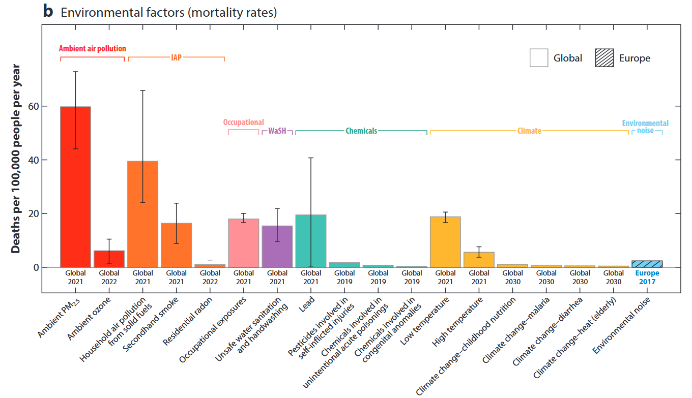
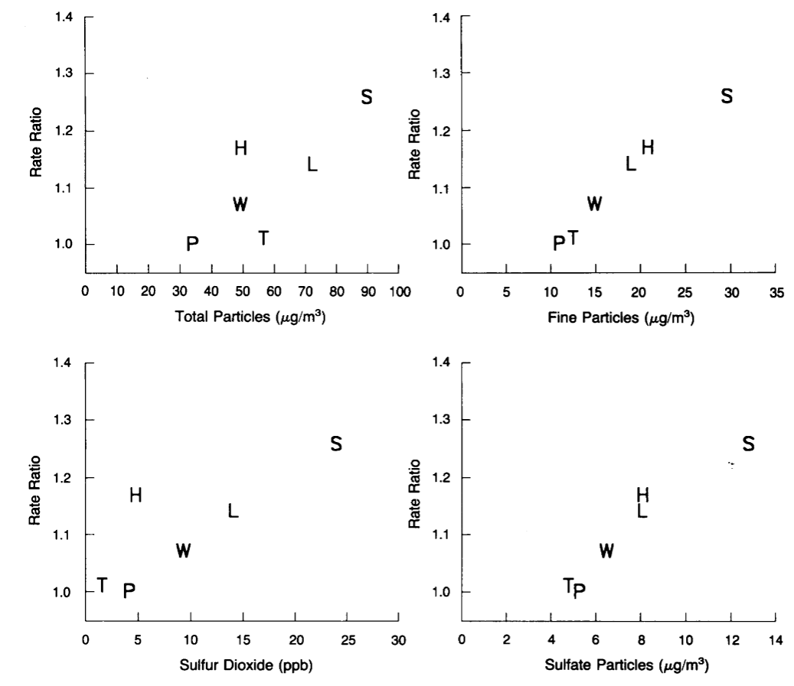
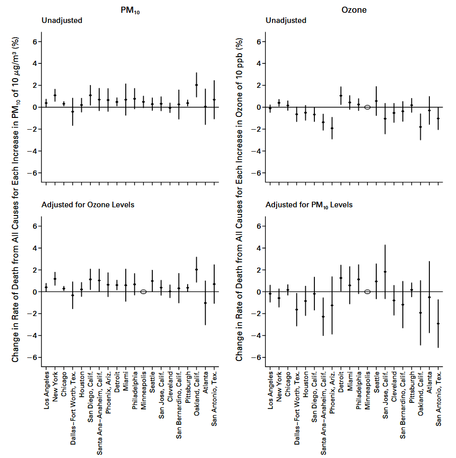
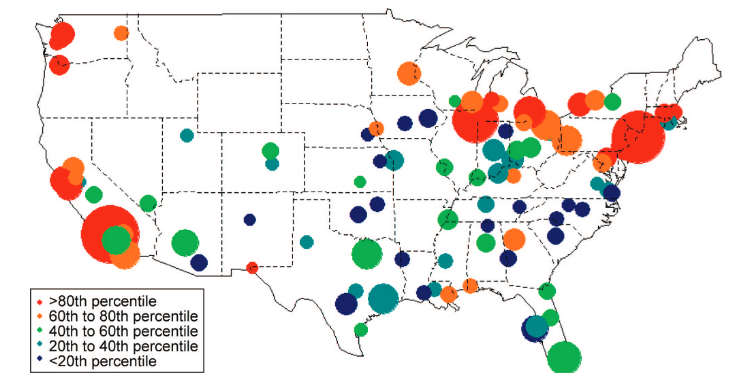
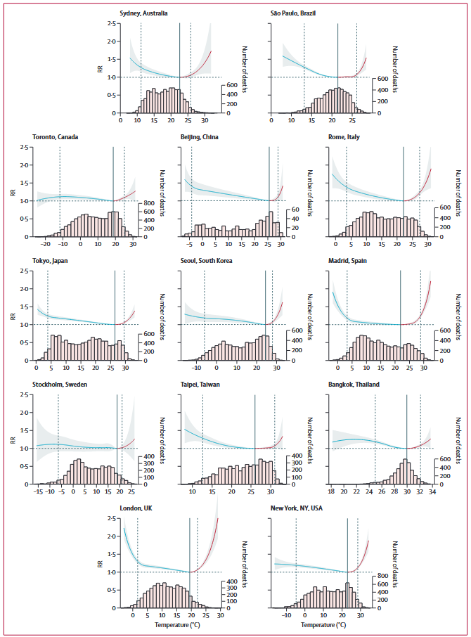
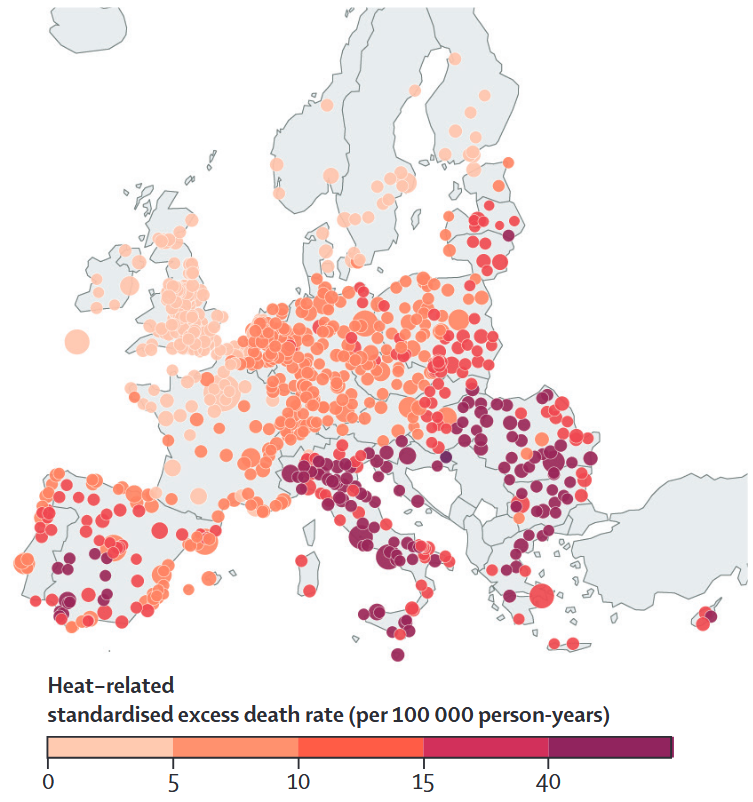
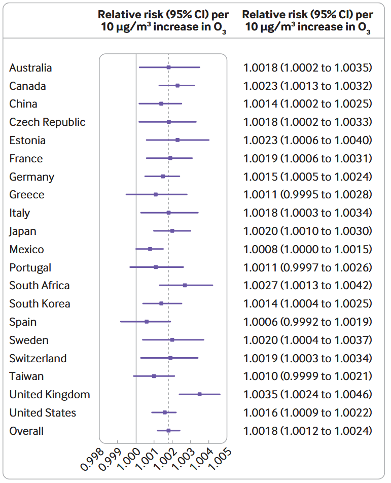
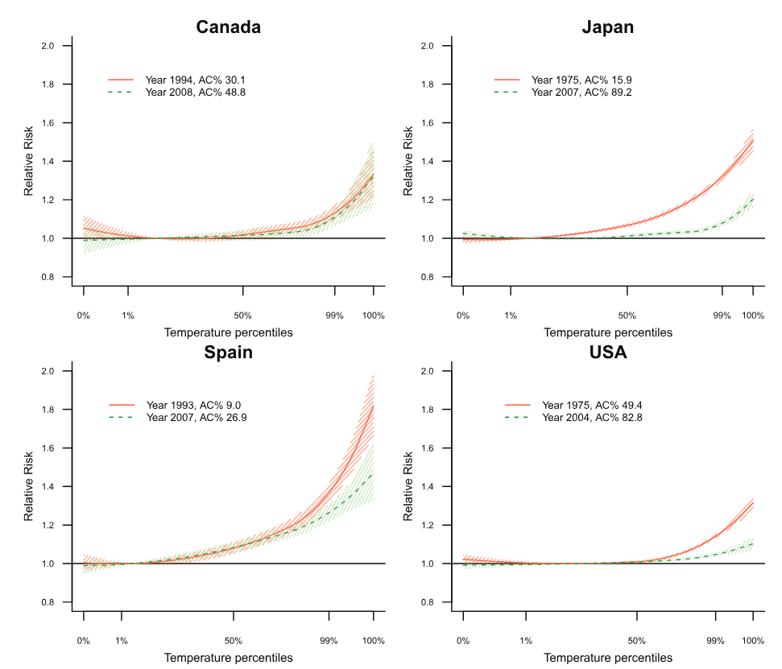

```{r}
#| cache: false
#| label: packages
# NB: disabling the cache is to ensure all packages are loaded 

#----- Packages

# Analysis
library(dlnm); library(splines); library(mixmeta)

# Convenience
library(tidyverse); library(knitr); library(sf)

# For QR codes and Github
library(qrcode); library(git2r)

# Plotting
library(RColorBrewer); library(plot3D); library(scico)

```

# Introduction: <br>Multi-location studies for environmental epidemiology

## Environment and health

Environmental exposure are important health risk factors

Collectively responsible for millions of deaths each year 

{fig-align="center"}


## Effects difficult to estimate

The impacts of ambient environmental exposures can be difficult to estimate

- Small effects: increase risks of adverse outcomes slightly
- Large impacts: everybody is exposed
- Exposition differs between populations

<br>

&DoubleRightArrow; We typically use several locations to alleviate these issues


## Air pollution and health

::: {layout-ncol=2}

{height="600"}

{height="600"}

:::


## Non-optimal temperature and health

::: {layout-ncol=2}



{height="600"}

:::

## Why multi-location studies?

More power to detect and estimate associations

- Allows bigger populations by considering several locations

Higher contrasts of exposure

- Different location will typically have very different levels

Estimation of heterogeneity of effects

- Allows to understand how the risk vary


## The two-stage framework

<br>

:::: {.columns}

::: {.column width="50%"}
1. Estimation of the association in each location independently
2. Pool estimated association in a meta-analysis model
:::

::: {.column}
```{mermaid}
%%| fig-align: center
flowchart TD
  c1[Location 1] --> par1(("$$\hat{\theta}_1$$"))
  c2[Location 2] --> par2(("$$\hat{\theta}_2$$"))
  cn[Location n] --> parn(("$$\hat{\theta}_n$$"))

  par1 --> meta[Meta-analysis]
  par2 --> meta[Meta-analysis]
  parn --> meta[Meta-analysis]
```
:::

::::


## Main features

Advantages

- **Computational gain**: management of nuisance parameters
- **Data protection**: large-scale studies with no data centralisation

Features

- Improved estimates (BLUPs)
- Uncertainty management
- Estimating effect modification


## Plan

We'll go through the main models for each stage

**Stage 1**: Distributed-lag (nonlinear) models

**Stage 2**: Mixed-effect meta-analysis


## Material

The whole material is available on GitHub

```{r}
#| echo: false
#| fig-height: 5
#| fig-align: center
#| label: QRcode

# Get remote url of current git repo
repo_url <- remote_url()

# Create QR code
qrmat <- qr_code(repo_url)

# Plot and save
plot(qrmat)
```


# First stage: <br>distributed-lag (nonlinear) models

```{r}
#| label: stage1_load

# Load results of models
load("data/stage1.RData")
```

## Example data

Association between coarse particulate matter and mortality

$$ \text{Deaths} \sim f(\text{PM}_{10})$$

- Deaths: daily counts
- PM~10~: Coarse particulate matter concentration ($\mu g/m^3$)

London (1996-2001)


## A look at the data

```{R}
#| layout-ncol: 2
#| fig-height: 6
#| fig-width: 5.5
#| fig-dpi: 96
#| label: showData

# Show data
london[,c("date", "death", "tmean")] |> head() |> kable()

# Plot
par(mfrow = c(2, 1), mar = c(4, 4.5, 0, 0), cex.axis = .9)
plot(death ~ date, data = london, type = "l", xlab = "", ylab = "Deaths")
plot(pm10 ~ date, data = london, type = "l", xlab = "Date", 
  ylab = expression(PM[10] ~ (mu*g/m^3)))

```


## The time-series design

These data are a typical example of a **time series design**

<br>Important design in environmental epidemiology

- Allows estimating lags
- Use ecological data

::: {.callout-note}
The methods we will see can be used with other designs:

Case-crossover, Case time series, Cohorts
:::


## Poisson model

Response $y_t$ is a count: we use a Poisson model[^1]

$$\mathbb{E}(y_t) = \exp \left(\alpha + \color{red}{x_t \beta} + \sum_{j=1}^p \color{green}{z_{tj} \gamma_j}\right)$$

- $\color{red}{x_t}$: Exposure (PM~10~)
- $\color{green}{z_{tj}}$: Covariates (Confounders such as day-of-year, day-of-week, etc)

[^1]: We often use a quasi-Poisson likelihood due to over-dispersion


## The typical time series model

```{r}
#| fig-height: 5
#| fig-width: 8
#| fig-align: center
#| out-height: 500px
#| out-width: 800px
#| label: PoissonBase

#----- Plots
par(mar = c(4, 3, 3, 1))
layout(matrix(c(1:3, 3), nrow = 2, byrow = T), width = c(2, 5))

# Main effect: PM10
plot(exp(coef0[2]), pch = 16, col = 2, xaxt = "n", ylab = "RR", 
  xlab = "", ylim = exp(ci0[2,]), main = expression(PM[10]))
arrows(x0 = 1, y0 = exp(ci0[2,1]), y1 = exp(ci0[2,2]), length = .05, 
  angle = 90, code = 3)
abline(h = 1)

# Week effect
ind <- grep("dow", names(coef0))
plot(seq_along(ind) + 1, exp(coef0[ind]), pch = 16, col = 3, 
  ylab = "RR", xlab = "", ylim = exp(range(ci0[ind,])),
  main = "Day of week")
arrows(x0 = seq_along(ind) + 1, y0 = exp(ci0[ind,1]), y1 = exp(ci0[ind,2]), 
  length = .05, angle = 90, code = 3)
abline(h = 1)

# Time effect
plot(death ~ date, data = london, type = "l", xlab = "", ylab = "Deaths", 
  col = "grey", main = "Splines of date")
lines(london$date[!is.na(timeff)], timeff[!is.na(timeff)], 
  col = 3, lwd = 2)
```

::: aside
RR: Relative risk $e^{\beta}$, RR = 1 means no association
:::


## Lagged association

The model becomes 

$$\mathbb{E}(y_t) = \exp \left(\alpha + \color{red}{\sum_{l=0}^L x_{t-l} \beta_l} + w_t\right)$$


```{r}
#| label: lags

# Show a few elements
data.frame(london[, c("date", "death")], xlags[,1:3])[21:23,] |> 
  kable(row.names = F, 
    col.names = c("Date", "Deaths", sprintf("PM10 (t-%i)", 0:2)))
```


## Lagged PM~10~ association

```{r}
#| fig-height: 4.5
#| fig-width: 7
#| fig-align: center
#| out-height: 600px
#| out-width: 900px
#| label: UnconsLag

# Plot
ind <- grep("xlags", names(coef1))
par(mar = c(4, 4, 2, 0))
plot(0:maxlag, exp(coef1[ind]), pch = 16, col = 2, ylab = "RR", 
  xlab = "Lag", ylim = exp(range(ci1[ind,])))
arrows(x0 = 0:maxlag, y0 = exp(ci1[ind,1]), y1 = exp(ci1[ind,2]), length = .05, 
  angle = 90, code = 3)
abline(h = 1)

```


## Issues with lagged association

<br> High degree of autocorrelation in environmental exposures

&DoubleRightArrow; Collinearity between the $\color{red}{x_{t-l}}$

<br> This leads to unstable estimates

<br> Constrain the coefficient to stabilise estimation


## Distributed-lag models (DLM)

Represents a **lag-response function** as a **smooth function of lags**

<br>This is done by **basis representation**:

$$\beta_l = \sum_k \theta_k B_k(l)$$

- $B_k(l)$ are predefined **basis functions**
- $\theta_k$ associated parameters


## Basis representation

At any lag, sum several nonlinear functions

```{r}
#| label: basisExpansion
#| layout-ncol: 2
#| fig-height: 5
#| fig-width: 7
#| fig-align: center
#| out-height: 600px
#| out-width: 840px

# With lags
l <- seq(0, 7, length.out = 40)

# Polynomial basis
polybasis <- poly(l, degree = 4)
matplot(l, polybasis, type = "l", 
  col = brewer.pal(ncol(polybasis) + 1, "Greens")[-1],
  lty = 1, lwd = 2, xlab = "Lag", ylab = "Basis", main = "Polynomial")

# B-spline basis
bsbasis <- ps(l, df = 5)
matplot(l, bsbasis, type = "l", 
  col = brewer.pal(ncol(bsbasis) + 1, "Greens")[-1],
  lty = 1, lwd = 2, xlab = "Lag", ylab = "Basis", main = "B-Splines")

```

## Fitting DLMs

With basis expansion we have

$$\begin{align}
  \color{red}{\sum_{l} x_{t-l} \beta_l} &= \sum_{l} x_{t-l} \sum_k \theta_k B_k(l) \\
  &= \sum_k \theta_k \sum_l x_{t-l} B_k(l)
\end{align}
$$
We define $k$ new variables $v_k = \sum_l x_{t-l} B_k(l)$ to obtain the Poisson model 

$$\mathbb{E}(y_t) = \exp \left(\alpha + \color{red}{\sum_{l=0}^L v_k \theta_k} + w_t\right)$$

## Fitting DLMs: matrix form

In matrix form, the basis expansion becomes

$$\begin{align}
  \color{red}{\mathbf{x}_t^T \boldsymbol{\beta}} &= \mathbf{x}_t^T \begin{bmatrix} \mathbf{B_1^T\boldsymbol{\theta}} \\ \vdots \\ \mathbf{B_L^T\boldsymbol{\theta}} \end{bmatrix} \\
  &= \mathbf{x}_t^T \mathbf{C} \boldsymbol{\theta}
\end{align}$$

The new predictor vector is then $\mathbf{v}_t^T = \mathbf{x}_t^T \mathbf{C}$

::: aside
$\mathbf{C}$ contains the bases $B_k(l)$
:::


## Lag-response function of PM~10~

:::: {.columns}

::: {.column width=40%}
<br>

- Natural cubic splines
- One internal knot

:::

:::{.column}
<br>

```{r}
#| label: DLM
#| fig-height: 4
#| fig-width: 6
#| out-width: 800px

# Plot
par(mar = c(4, 4, 2, 0))
plot(0:maxlag, lrf2$matRRfit, pch = 16, col = 2, ylab = "RR", 
  xlab = "Lag", ylim = range(unlist(lrf2[c("matRRlow", "matRRhigh")])))
arrows(x0 = 0:maxlag, y0 = lrf2$matRRlow, y1 = lrf2$matRRhigh, length = .05, 
  angle = 90, code = 3)
abline(h = 1)
```
:::
::::

## Nonlinear associations: temperature

DLMs still assume a **linear** association at each lag

This is typically not realistic for temperature

- Increased risk for both heat and cold

<br> Therefore we seek to relax this assumption with a model of the form

$$\color{red}{\sum_{l} f(x_{t-l}, l)}$$

- Smooth over both $x_{t-l}$ and $l$


## Tensor product

:::: {.columns}

::: {.column width="40%"}

Estimate the two-dimensional surface

$$f(x,l) = \sum_k^K \sum_m^M \theta_{km} B_k(x) B_m(l)$$

- $B_k()$ and $B_m()$ are two sets of basis functions

:::

::: {.column}

```{r}
#| label: tensor
#| cache: true
#| fig-width: 5
#| fig-height: 5
#| out-width: 600px
#| out-height: 600px
#| fig-align: right

# Grid
xdf <- 5; ldf <- 4
x <- seq(-1, 1, length.out = 20)
l <- seq(0, 7, length.out = 20)

# Color palette
pal <- scico(xdf * ldf, palette = "bamako")

# Plot
m <- mesh(x, l)
z <- outer(x, l, function(xx, yy)  ps(xx, df = xdf)[,1] * ps(yy, df = ldf)[,1])
surf3D(m$x, m$y, z, col = pal[1], box = FALSE, theta = 60, border = "black")
for (i1 in 1:xdf) for (i2 in 1:ldf){
  if (i1 == 1 & i2 == 1) next
  z <- outer(x, l, function(xx, yy)  
    ps(xx, df = xdf)[,i1] * ps(yy, df = ldf)[,i2])
  surf3D(m$x, m$y, z, col = pal[(i1-1) * ldf + i2], box = FALSE, 
    theta = 60, add = T, border = "black")
}
box()
```

:::
::::


## The crossbasis

We can now rewrite our model

$$\begin{align} 
  \color{red}{\sum_{l} f(x_{t-l}, l)} &= \sum_{l}^L \sum_k^K \sum_m^M \theta_{km} B_k(x_{t-l}) B_m(l) \\
  & = \sum_k^K \sum_m^M \theta_{km} \sum_{l}^L B_k(x_{t-l}) B_m(l)
\end{align}$$

which defines 

- $KM$ bases $\sum_{l}^L B_k(x_{t-l}) B_m(l)$ cumulated over lags
- $KM$-dimensional parameter vector $\boldsymbol{\theta}$


## Matrix representation

The tensor product can be represented 

$$ \mathbf{B}_x^T(x) \boldsymbol{\Theta} \mathbf{B}_l(l) = \left(\mathbf{B}_x^T(x) \otimes \mathbf{B}_l^T(l)\right) \boldsymbol{\theta}$$
with $\boldsymbol{\theta} = \text{vec}(\boldsymbol{\Theta})$

The model becomes

$$ \color{red}{\sum_{l} f(x_{t-l}, l)} = \sum_l \left(\mathbf{B}_x^T(x_{t-l}) \otimes \mathbf{B}_l^T(l)\right) \boldsymbol{\theta}$$

Therefore we can simply use $\sum_l \left(\mathbf{B}_x^T(x_{t-l}) \otimes \mathbf{B}_l^T(l)\right) \boldsymbol{\theta}$ as new variables


## Fitting a DLNM

<br>We plug our new bases in the Poisson model

$$\mathbb{E}(y_t) = \exp \left(\alpha + \color{red}{\sum_l \left(\mathbf{B}_x^T(x_{t-l}) \otimes \mathbf{B}_l^T(l)\right) \boldsymbol{\theta}} + w_t\right)$$

and the vector $\boldsymbol{\theta}$ can be used to reconstruct the surface

<br><br>[**This means DLNMs can be fitted through any linear model**]{style="color: #004550;"}


## Example results

:::: {.columns}

::: {.column width=40%}
<br>
Association between temperature and mortality

- Five cubic B-splines on temperature dimension
- Four cubic B-splines on lag dimension

:::

:::{.column}
```{r}
#| label: DLNM
#| fig-height: 7
#| fig-width: 7
#| out-width: 1000px
#| fig-align: right

# Plot
plot(surf3, zlab = "RR", xlab = "Temperature (C)")
```
:::
::::

## Reducing DLNMs

We often want to reduce the surface to the **overall cumulative association**

<br> &DoubleRightArrow; Cumulates the risk across lags

$$f_{ov}(x) = \sum_l f(x,l) = B_x(x)\theta_{ov}$$

<br>We can derive a **reduced** parameter vector $\theta_{ov}$ that defined the cumulative association with the marginal basis $B_x(x)$


## Summary

To estimate the association between environmental exposures and health outcomes, we typically use **distributed lag nonlinear models** (DLNM)

<br>Models associations that are

- Nonlinear
- Delayed 

It works by building a **crossbasis**

## Software and code

::: {.columns}

::: {.column width=50%}
<br>
Implemented for **R** in the package `dlnm`

<br>The repo provides examples of how to use it

:::

::: {.column width=50%}
```{r}
#| echo: false
#| fig-height: 5
#| fig-width: 5
#| fig-align: center
#| label: QRex1
#| out-height: 500px
#| out-width: 500px

# Get remote url of current git repo
repo_url <- remote_url()
exurl <- paste0(repo_url,"blob/main/examples/Stage1_dlnm.R")

# Create QR code
qrex <- qr_code(exurl)

# Plot and save
plot(qrex)
```
:::
::::


## Bibliographic notes

DLMs were initially proposed by @Almon1965DistributedLagCapital for **econometrics**

Introduced by @Schwartz2000DistributedLagAir with polynomials to estimate the association between mortality and **air pollution**

@ZanobettiEtAl2000GeneralizedAdditiveDistributed used **splines in DLMs**

@Armstrong2006ModelsRelationshipAmbient laid the ground work for **nonlinear** DLNMs with the aim of modelling temperature-related mortality

@GasparriniEtAl2010DistributedLagNonlinear puts everything together developing the **algebra of DLNMs**

@BhaskaranEtAl2013TimeSeriesRegression provides an overview of the **time series design**


# Second-stage: meta-analysis

## Why multi-location studies

We just saw the very complex DLNM

&DoubleRightArrow; Needs a high number of cases for stable estimation

<br> Several locations allows higher power to estimate associations

<br> Vulnerability can vary between locations


## An example: the Italian dataset

:::: {.columns}

::: {.column width=40%}
<br>

- Temperature-related mortality
- 87 Italian cities
- 2011-2021

:::

::: {.column}
```{r}
#| label: italy_map
#| fig-width: 7
#| fig-height: 7
#| out-height: 600px
#| out-width: 600px
#| warning: false
#| fig-align: right

# Load results of the analysis
load("data/stage2.RData")

# Read data
italymap <- st_read("data/italymap.shp", quiet = T)

# Plot
ggplot(metadata) + theme_void() + 
  geom_sf(data = italymap, fill = grey(.9), inherit.aes = F, col = grey(.5)) +
  geom_point(aes(x = lon, y = lat))

```
:::
::::


## Some first-stage curves

:::: {.columns}

::: {.column width=40%}
<br>
We fit a DLNM on each city independently

- 87 sets of coefficients $\boldsymbol{\theta}_{ov}$ and (co)-variance matrices

:::

::: {.column}

```{r}
#| label: firstStageCurves
#| fig-height: 8
#| fig-width: 8
#| out-width: 600px
#| out-height: 600px
#| fig-align: right

# Select cities to display
cit <- c(1, 7, 23, 87)

# Loop over
par(mfrow = c(2, 2))
for (i in cit){
  
  # Plot
  td <- stage1res[[i]]$tdist
  basis <- onebasis(td, fun = varfun, knots = td[sprintf("%.1f%%", varper)],
    degree = vardegree)
  cp <- crosspred(basis, coef = coefs[i,], vcov = vcovs[[i]], 
    model.link = "log", cen = 20)
  plot(cp, xlab = "Temperature", ylab = "RR", main = metadata$city_name[i])
}

```
:::
::::

## Pooling the curves: meta-analysis

Meta-analysis pools the parameter from several "studies" to improve power:

$$\boldsymbol{\theta}_i = \color{red}{\boldsymbol{\theta}} + \boldsymbol{\epsilon}_i$$

- $\color{red}{\boldsymbol{\theta}}$: The parameters that represents the association (DLNM)
- $i$ is the city index
- $\boldsymbol{\epsilon}_i \sim \mathcal{N}(\mathbf{0}, \mathbf{S}_i)$ is the error in city $i$
- $\mathbf{S}_i$ is the (co)-variance matrix estimated in first-stage

**Assumption**: The true association is the same in all cities

## Estimating the overall effect

The estimated $\color{red}{\boldsymbol{\theta}}$ is the weighted mean of the $\boldsymbol{\theta}_i$:

$$\hat{\boldsymbol{\theta}} = \frac{\sum_i \mathbf{S}_i^{-1}\boldsymbol{\theta}_i}{\sum_i \mathbf{S}_i^{-1}}$$

<br>**Intuition**: 

- The higher the variance $\mathbf{S}_i$, the lower the weight for city $i$
- Pulls $\hat{\boldsymbol{\theta}}$ towards the most accurate cities

## Meta-analysing Italian data


```{r}
#| label: fixmeta
#| fig-width: 6
#| fig-height: 4
#| out-width: 900px
#| out-height: 600px
#| fig-align: center

# Overall basis for easy plotting
td <- sapply(stage1res, "[[", "tdist") |> rowMeans()
basis <- onebasis(td, fun = varfun, knots = td[sprintf("%.1f%%", varper)],
  degree = vardegree)
cenb <- onebasis(20, fun = varfun, knots = td[sprintf("%.1f%%", varper)],
  degree = vardegree)
ovbasis <- scale(basis, center = cenb, scale = F)

# Get curves
curves <- exp(ovbasis %*% t(coefs[cit,]))

# Get overall
ovcurve <- crosspred(ovbasis, coef = fixeff$fit, vcov = fixeff$vcov, 
  model.link = "log", cen = 20)

# Plot
par(mar = c(4, 4, 0, 2))
plot(ovcurve, xlab = "Temperature percentile", ylab = "RR", xaxt = "n", 
  ylim = range(curves), lwd = 2, col = 2)
axper <- c(1, 25, 50, 75, 99)
axis(1, at = td[sprintf("%.1f%%", axper)], labels = axper)
matlines(td, curves, lty = 1, col = "black")
```

## Random effect meta-analysis

We can relax the assumption of common association

$$\boldsymbol{\theta}_i = \boldsymbol{\theta} + \boldsymbol{\xi}_i + \boldsymbol{\epsilon}_i$$

- $\boldsymbol{\xi}_i \sim \mathcal{N}(\mathbf{0}, \boldsymbol{\Psi})$: city-specific deviation from overall effect
- Now we have $\boldsymbol{\theta}_i \sim \mathcal{N}(\boldsymbol{\theta}, \mathbf{S}_i + \boldsymbol{\Psi})$

This model decomposes the between study variation into:

1. Error from first-stage statistical model ($\mathbf{S}_i$)
2. Heterogeneity of associations ($\boldsymbol{\Psi}$)


## Best linear unbiased predictions (BLUP)

We can predict associations from the model as

$$\hat{\boldsymbol{\theta}}_i = \color{red}{\hat{\boldsymbol{\theta}}} + \color{green}{\frac{\hat{\boldsymbol{\Psi}}}{\mathbf{S}_i + \hat{\boldsymbol{\Psi}}} \left(\boldsymbol{\theta}_i -  \hat{\boldsymbol{\theta}}\right)}$$

-  $\hat{\boldsymbol{\theta}}$ and $\hat{\boldsymbol{\Psi}}$ are *maximum-likelihood estimates*

The prediction sums two components:

1. [The overall effect $\hat{\boldsymbol{\theta}}$]{style="color: red;"}
2. [The part of the deviation that is due to the random effect $\hat{\boldsymbol{\Psi}}$]{style="color: green;"}

## BLUPs on Italian data

```{r}
#| label: ranblups
#| fig-align: center
#| layout-ncol: 2
#| fig-height: 6
#| fig-width: 8
#| out-height: 800px
#| out-width: 1000px

#----- First plot: overall effect

# Get overall from random effect
rancurve <- crosspred(ovbasis, coef = raneff$fit, vcov = raneff$vcov, 
  model.link = "log", cen = 20)

# Plot
par(mar = c(4, 4, 2, 2))
plot(ovcurve, xlab = "Temperature percentile", ylab = "RR", xaxt = "n", 
  ylim = range(curves), lwd = 2, col = 2, 
  ci.arg = list(col = adjustcolor("red", alpha = .2)),
  main = "Overall")
axper <- c(1, 25, 50, 75, 99)
axis(1, at = td[sprintf("%.1f%%", axper)], labels = axper)
lines(rancurve, lwd = 2, col = "#004550", ci = "area", 
  ci.arg = list(col = adjustcolor("#004550", alpha = .2)))
legend("topleft", legend = c("Fixed effect", "Random effect"), lty = 1, lwd = 2,
  col = c("red", "#004550"), title = "Model", horiz = T)

#----- Second plot: BLUPs

par(mfrow = c(2, 2), mar = c(4, 4, 2, 1))
for (i in cit){
  
  # Plot
  td <- stage1res[[i]]$tdist
  basis <- onebasis(td, fun = varfun, knots = td[sprintf("%.1f%%", varper)],
    degree = vardegree)
  cp <- crosspred(basis, coef = coefs[i,], vcov = vcovs[[i]], 
    model.link = "log", cen = 20)
  cpbl <- crosspred(basis, coef = ranblups[[i]]$blup, vcov = ranblups[[i]]$vcov, 
    model.link = "log", cen = 20)
  plot(cp, xlab = "Temperature", ylab = "RR", main = metadata$city_name[i], 
    lwd = 2)
  lines(cpbl, col = "#004550", lwd = 2)
}


```

## Meta-regression

Random effect meta-analysis models heterogeneity, but doesn't *associate it to city characteristics*

Meta-regression adds meta-predictors $\mathbf{X}_i$ **that can explain the heterogeneity**

$$\boldsymbol{\theta}_i = \mathbf{X}_i\boldsymbol{\beta} + \boldsymbol{\xi}_i + \boldsymbol{\epsilon}_i$$

- $\boldsymbol{\beta}$ is the effect of meta-predictors $\mathbf{X}_i$ on our association $\boldsymbol{\theta}_i$
- Now $\boldsymbol{\Psi}$ represents the heterogeneity that is explained neither by first-stage error or meta-predictors

## Interpreting meta-regression

:::: {.columns}

::: {.column width=30%}
<br>We add *GDP per capita* as a meta-predictor
:::

::: {.column width=70%}
```{r}
#| label: effmodif
#| fig-align: right
#| fig-width: 6
#| fig-height: 5
#| out-width: 800px
#| out-height: 600px

# Get predicted curves
lowcurve <- crosspred(ovbasis, coef = preds[[1]]$fit, vcov = preds[[1]]$vcov, 
  model.link = "log", cen = 20)
hicurve <- crosspred(ovbasis, coef = preds[[2]]$fit, vcov = preds[[2]]$vcov, 
  model.link = "log", cen = 20)

# Plot
par(mar = c(4, 4, 0, 0))
plot(lowcurve, xlab = "Temperature percentile", ylab = "RR", xaxt = "n", 
  lwd = 2, col = "#00BF6F", 
  ci.arg = list(col = adjustcolor("#00BF6F", alpha = .2)))
axper <- c(1, 25, 50, 75, 99)
axis(1, at = td[sprintf("%.1f%%", axper)], labels = axper)
lines(rancurve, lwd = 2, col = "#004550", ci = "area", 
  ci.arg = list(col = adjustcolor("#004550", alpha = .2)))
legend("topleft", legend = c("Low", "High"), lty = 1, lwd = 2,
  col = c("#00BF6F", "#004550"), title = "GDPpc", horiz = T)

```

:::
::::


## The full mixed effects framework

All the models are generalised in the mixed-effects meta-regression framework

$$\boldsymbol{\theta}_i = \mathbf{X}_i\boldsymbol{\beta} + \mathbf{Z}_i\mathbf{b}_i + \boldsymbol{\epsilon}_i$$

- $\mathbf{Z}_i$ are random-effects meta-predictors whose effect $\mathbf{b}_i$ varies by city
- This notably allows multi-level random effects (city within country)

<br> Estimated by (restricted) maximum-likelihood


## BLUPs again

The full model allows to compute BLUPs, obtaining improved estimates of the association in each city

$$\hat{\boldsymbol{\theta}}_i = \color{red}{\mathbf{X}_i\hat{\boldsymbol{\beta}}} + \color{green}{\frac{\mathbf{Z}_i\hat{\boldsymbol{\Psi}}\mathbf{Z}_i^T}{\mathbf{S}_i + \mathbf{Z}_i\hat{\boldsymbol{\Psi}}\mathbf{Z}_i^T} \left(\boldsymbol{\theta}_i - \mathbf{X}_i\hat{\boldsymbol{\beta}}\right)}$$

Similar interpretation as before

- [Fixed effect prediction]{style="color: red;"}
- [Part of deviation due to random effect prediction]{style="color: green;"}

## Full BLUPs for Italian cities

```{r}
#| label: fullBLUPS
#| fig-height: 6
#| fig-width: 8
#| out-width: 800px
#| out-height: 600px
#| fig-align: center

par(mfrow = c(2, 2), mar = c(4, 4, 2, 1))
for (i in cit){
  
  # Plot
  td <- stage1res[[i]]$tdist
  basis <- onebasis(td, fun = varfun, knots = td[sprintf("%.1f%%", varper)],
    degree = vardegree)
  cp <- crosspred(basis, coef = coefs[i,], vcov = vcovs[[i]], 
    model.link = "log", cen = 20)
  cpbl <- crosspred(basis, coef = blup_coefs[[i]]$blup, 
    vcov = blup_coefs[[i]]$vcov, 
    model.link = "log", cen = 20)
  plot(cp, xlab = "Temperature", ylab = "RR", main = metadata$city_name[i], 
    lwd = 2)
  lines(cpbl, col = "#004550", lwd = 2)
}

```

## The full framework

::: {.center-align style="text-align: center;"}
```{mermaid}
%%| label: flowchart
%%| fig-align: center
%%| fig-height: 6
flowchart LR
  %% Define nodes for first-stage
  subgraph stage1 ["First-stage (DLNM)"]
    c1[Location 1]
    c2[Location 2]
    cn[Location n]
    par1(("$$\hat{\theta}_1,\mathbf{S}_1,\mathbf{X}_1,\mathbf{Z}_1$$"))
    par2(("$$\hat{\theta}_2,\mathbf{S}_2,\mathbf{X}_2,\mathbf{Z}_2$$"))
    parn(("$$\hat{\theta}_n,\mathbf{S}_n,\mathbf{X}_n,\mathbf{Z}_n$$"))
  end
  
  %% vertices
  c1 --> par1
  c2 --> par2
  cn --> parn
  par1 --> meta[Meta-analysis]
  par2 --> meta
  parn --> meta
  
  %% BLUPs
  subgraph stage2 ["Second-stage and BLUPs"]
    meta --> blup1(("$$\hat{\theta}_1^{(b)}$$")) 
    meta --> blup2(("$$\hat{\theta}_2^{(b)}$$"))
    meta --> blupn(("$$\hat{\theta}_n^{(b)}$$"))
  end
  
  %% Styling
  style stage1 fill: white
  style stage2 fill: white
```
:::

## Software and code

::: {.columns}

::: {.column width=50%}
<br>
Meta-analysis implemented for **R** in the package `mixmeta`

Also see `meta`, `metafor` and `dmetar`

<br>The repo provides examples of how to use it

:::

::: {.column width=50%}
```{r}
#| echo: false
#| fig-height: 5
#| fig-width: 5
#| fig-align: center
#| label: QRex2
#| out-height: 500px
#| out-width: 500px

# Get remote url of current git repo
repo_url <- remote_url()
exurl <- paste0(repo_url,"blob/main/examples/Stage2_multiLoc.R")

# Create QR code
qrex <- qr_code(exurl)

# Plot and save
plot(qrex)
```
:::
::::

## Bibliographic notes

@DominiciEtAl2000CombiningEvidenceAir used a **Bayesian hierarchical model** to pool log-linear associations of pollutants in 20 US cities.

@GasparriniEtAl2012MultivariateMetaanalysisNonlinear proposed **multivariate meta-analysis** models to pool multi-parameter associations.

@SeraEtAl2019ExtendedMixedeffectsFramework developed the full **mixed-effects framework for meta-analysis and regression**.

@SeraGasparrini2022ExtendedTwostageDesigns and @MasselotGasparrini2025ModellingExtensionsMultilocation provide **overviews and extensions for multi-location studies**.

# Some examples


## Temperature-related mortality across the world

:::: {.columns}

::: {.column width=40%}
$\boldsymbol{\theta}$: Five quadratic B-Spline parameters representing the overall cumulative association

Meta-analysis:

- Meta-predictors representing local characteristics
- City-level random effect ($\mathbf{Z} = \mathbf{I}_n$)
:::

::: {.column width=30%}

:::

::: {.column width=30%}

:::
::::


## PM-related mortality

:::: {.columns}

::: {.column width=50%}
$\theta$: Single regression parameter for log-linear association

Meta-analysis:

- No meta-predictor
- **Multilevel** city within country random effect
:::

::: {.column width=50%}
{height=500px}
:::

::::


## Air-conditioning and heat-related mortality

:::: {.columns}

::: {.column width=50%}
$\boldsymbol{\theta}$: Four quadratic B-Spline parameters representing the overall cumulative association

Meta-analysis:

- Meta-predictors: air-conditioning prevalence and other covariates
- City-level random effect
:::

::: {.column width=50%}
{height=500px}
:::

::::


# Conclusion

## Epidemiological framework

**Multi-location** framework for improved power and computational efficiency

1. Fit **location-specific model** to estimate the association of interest
2. **Pool** location-specific parameters into a meta-analysis model

<br>This allows:

- Improved location-specific estimates
- Heterogeneity modelling

## Full material

:::: {.columns}

::: {.column width=50%}
<br>

- Slides (and Quarto document to generate them)
- Scripts for examples
- Data used in examples
:::

::: {.column width=50%}
```{r}
#| echo: false
#| fig-height: 5
#| fig-width: 5
#| fig-align: center
#| label: QRcode2
#| out-height: 500px
#| out-width: 500px

# Plot and save
plot(qrmat)
```
:::
::::


## Bibliography {.scrollable}

::: {#refs}
:::